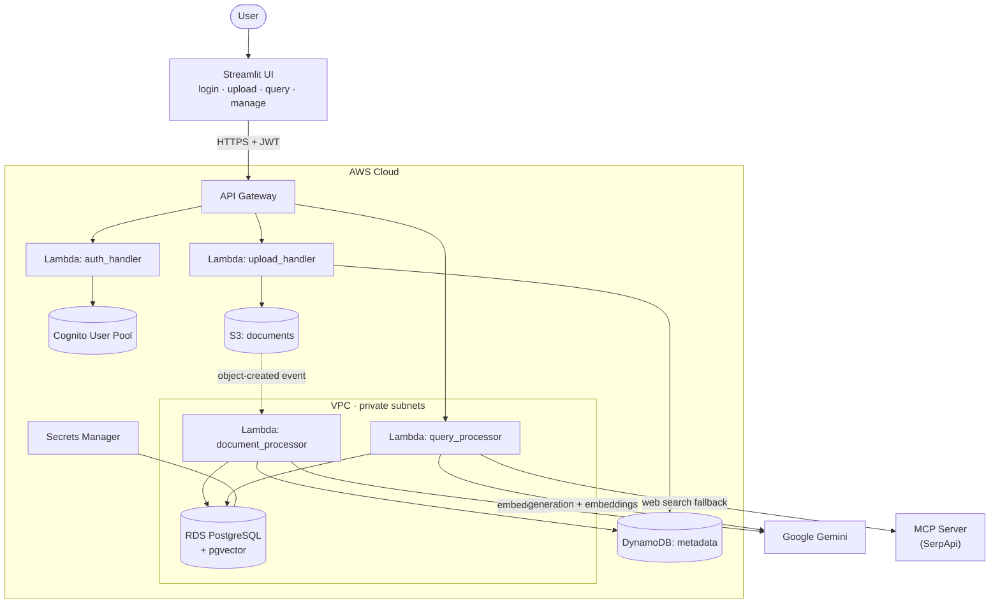
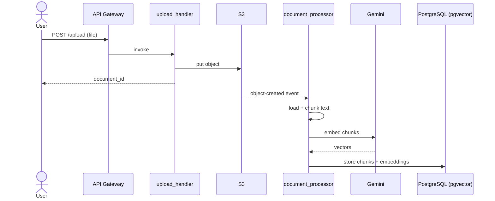
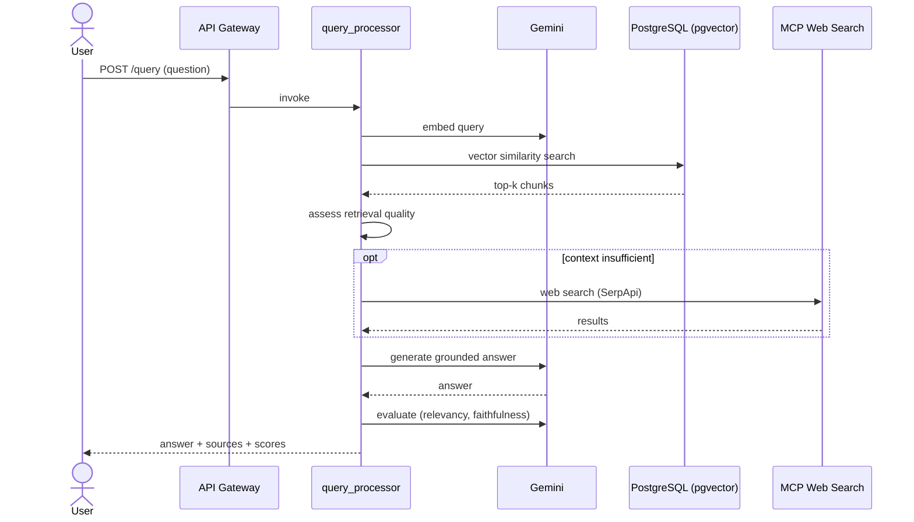

<div align="center">
    <h1>☁️ CloudRAG</h1>
    <p><strong>Serverless Retrieval-Augmented Generation on AWS — with answer evaluation and real-time web search.</strong></p>
    &nbsp;
    &nbsp;
    &nbsp;
    &nbsp;
    
</div>

---

## 🔍 Overview

**CloudRAG** is an end-to-end Retrieval-Augmented Generation platform deployed entirely as **Infrastructure as Code** on AWS. Upload documents, and CloudRAG chunks, embeds, and indexes them into a PostgreSQL vector store. Ask questions in natural language and it retrieves the most relevant passages, generates a grounded answer with Google Gemini, scores the answer's quality, and — when your documents don't contain enough context — falls back to a **real-time web search** via a remote MCP server.

The whole backend is provisioned with Terraform across `dev`, `staging`, and `production` environments, and ships with a Streamlit UI for interacting with it.

## ✨ Features

- **Serverless backend** — five focused AWS Lambda functions (auth, upload, document processing, querying, DB init).
- **Vector search** — PostgreSQL RDS with the `pgvector` extension, and an IVFFlat index for fast cosine similarity.
- **Grounded generation** — answers produced by Google Gemini using retrieved context.
- **Agentic web search** — when local retrieval is weak, CloudRAG queries a remote **MCP server** (SerpApi) over streamable HTTP.
- **Built-in RAG evaluation** — every answer is scored for *relevancy*, *faithfulness*, and (optionally) *context precision*.
- **Secure auth** — AWS Cognito user pools with token refresh, wired through the UI.
- **Document management** — list and delete your uploaded documents from the UI.
- **Infrastructure as Code** — modular Terraform, multi-environment, with GitHub Actions CI/CD.
- **Tested** — unit tests for every Lambda, runnable locally and in CI.

## 🏗️ Architecture



Lambdas that touch the database run inside the VPC's **private subnets**; outbound calls to Gemini and the MCP server go through a **NAT gateway**, while S3 and DynamoDB are reached over **VPC endpoints**.

## ⚙️ How it works

### Document ingestion



### Query answering



## 🧰 Tech stack

| Layer | Technology |
|---|---|
| Infrastructure | Terraform (modular, multi-environment) |
| Compute | AWS Lambda (Python 3.11) |
| API | Amazon API Gateway |
| Vector store | Amazon RDS for PostgreSQL + `pgvector` |
| Object storage | Amazon S3 |
| Metadata | Amazon DynamoDB |
| Auth | Amazon Cognito |
| Secrets | AWS Secrets Manager |
| Observability | Amazon CloudWatch + SNS |
| LLM & embeddings | Google Gemini |
| Web search | MCP server (FastMCP) + SerpApi |
| Frontend | Streamlit |
| CI/CD | GitHub Actions |

## 🗂️ Repository structure

```
.
├── environments/          # Per-environment Terraform roots (dev, staging, prod)
├── modules/               # Reusable Terraform modules
│   ├── api/               # API Gateway
│   ├── auth/              # Cognito
│   ├── compute/           # Lambda functions + IAM
│   ├── database/          # RDS PostgreSQL, pgvector, Secrets Manager
│   ├── monitoring/        # CloudWatch, alarms, SNS
│   ├── storage/           # S3 + DynamoDB
│   └── vpc/               # VPC, subnets, NAT, endpoints, security groups
├── src/                   # Lambda source (Python)
│   ├── auth_handler/      # Cognito auth operations
│   ├── db_init/           # pgvector + schema initialization
│   ├── document_processor/# Ingest: load → chunk → embed → store
│   ├── query_processor/   # Retrieve → generate → evaluate → (web search)
│   ├── upload_handler/    # Upload + document management (list/delete)
│   └── tests/unit/        # Unit tests
├── mcp_servers/           # Remote MCP web-search server (SerpApi)
├── rag_ui/                # Streamlit frontend
├── scripts/               # Cleanup / diagnostics helpers
├── pyproject.toml
└── tox.ini
```

## 🚀 Getting started

### Prerequisites

- An AWS account and the AWS CLI (configured credentials)
- Terraform ≥ 1.5
- Python 3.11
- A **Google Gemini API key** (free tier works)
- *(Optional)* A **SerpApi key** for web-search fallback

### 1. Configure secrets

Store your API keys in AWS Secrets Manager (the Terraform database module wires the DB secret automatically). At minimum, provide the Gemini API key the Lambdas expect via the secret referenced by `GEMINI_SECRET_ARN`.

### 2. Deploy the infrastructure

```bash
cd environments/dev
terraform init
terraform plan
terraform apply
```

Repeat for `environments/staging` and `environments/prod` as needed. Each environment has its own `terraform.tfvars`.

### 3. Initialize the database

The `db_init` Lambda creates the `pgvector` extension and the `documents` / `chunks` tables. Invoke it once after the RDS instance is available (the CI/CD pipeline does this automatically).

### 4. Run the UI

```bash
cd rag_ui
pip install -r requirements.txt
cp .env.example .env      # set API_ENDPOINT and Cognito values
streamlit run app.py
```

See [`rag_ui/README.md`](./rag_ui/README.md) for UI details.

### 5. (Optional) Run the MCP web-search server

```bash
cd mcp_servers
pip install -r requirements.txt
export SERPAPI_API_KEY=your_key
python web_search_mcp_server.py --host 0.0.0.0 --port 8000
```

See [`mcp_servers/README.md`](./mcp_servers/README.md) for deployment options.

## 🔧 Configuration

Key environment variables consumed by the Lambdas (set via Terraform):

| Variable | Purpose |
|---|---|
| `GEMINI_SECRET_ARN` | Secrets Manager ARN holding the Gemini API key |
| `DB_SECRET_ARN` | Secrets Manager ARN for PostgreSQL credentials |
| `GEMINI_EMBEDDING_MODEL` | Embedding model (768-dim) |
| `TEMPERATURE`, `TOP_P`, `TOP_K`, `MAX_OUTPUT_TOKENS` | Generation parameters |
| `ENABLE_EVALUATION` | Toggle RAG answer evaluation |
| `RAG_CONFIDENCE_THRESHOLD`, `MIN_CONTEXT_LENGTH` | When to trigger web-search fallback |
| `EMBEDDING_MAX_RETRIES`, `EMBEDDING_RETRY_DELAY` | Embedding retry/backoff |
| `CORS_ALLOW_ORIGIN` | Allowed CORS origin (set to your UI origin in production; `*` for local/dev) |

## 🧪 Testing

```bash
pip install -r requirements-dev.txt
pytest src/tests/unit -v
# or, matching CI:
tox -e py
```

Unit tests mock all AWS, Gemini, and database access, so they run fully offline.

## 💰 Cost

Roughly **~$1–3** to experiment on a new AWS account: most services are Free-Tier eligible (incl. RDS `db.t3.micro`), and the main cost is the NAT gateway (~$1/day) — so deploy, test, and tear down the same day with `terraform destroy` (or the helper in `scripts/cleanup.sh`).

## 📄 License

Released under the [MIT License](./LICENSE). © 2026 P Rishabh.
