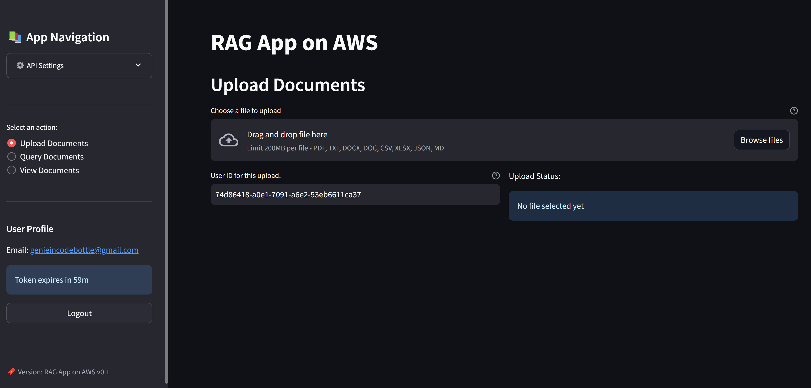

## CloudRAG UI: Local Streamlit Frontend with AWS Cloud Backend 

A Streamlit based web app for Retrieval Augmented Generation (RAG) powered by AWS services.




### 🧩 Overview

A web interface to upload documents, query them using natural language, and retrieve AI-generated responses via an AWS-powered RAG backend using Google's free-tier Gemini Pro and Embedding models.

### ✨ Features

- Secure Cognito-based user authentication with auto token refresh
- Upload, view, and manage various document types
- AI-powered querying using RAG with relevance scoring and history
- RAG Evaluation
- Uses the Web Search option via a locally or cloud-hosted MCP Server (HTTP Streaming) when RAG results are insufficient.

### 🔁 Application Flow Diagrams

- [Authentication Flow](./images/auth_sequence.png)
- [Doc Upload Flow](./images/document_upload_sequence.png)
- [Doc Processing Flow](./images/doc_processing_sequence.png)
- [Query Processing Flow](./images/query_processing_sequence.png)

### 🏗️ System Architecture

- **Frontend**: Streamlit UI
- **Backend**: AWS API Gateway, Lambda, Cognito, S3, RDS/OpenSearch, Bedrock (or similar)

### ⚙️ Prerequisites

- Python 
- Streamlit 
- AWS account with backend APIs deployed

### 🚀 Installation

```bash
git clone https://github.com/prishabh3/CloudRag.git

cd CloudRag/rag_ui

pip install uv # If uv doesn't exist in your system

uv venv

.venv\Scripts\activate   # Linux: source .venv/bin/activate

uv pip install -r requirements.txt
```

### 🛠️ Configuration

Create a `.env` file:

```env
# RAG Application API Configuration
API_ENDPOINT=https://your-api-gateway-url.amazonaws.com/stage
UPLOAD_ENDPOINT=/upload
QUERY_ENDPOINT=/query
AUTH_ENDPOINT=/auth

# Default user settings
DEFAULT_USER_ID=test-user

# Cognito Configuration
COGNITO_CLIENT_ID=your_cognito_client_id

# Enabling/disabling evaluation
ENABLE_EVALUATION="true"
```

Once the GitHub Action pipeline completes successfully, you can download the zipped environment variables file from the GitHub Artifact. Unzip it, open the file, and copy both API_ENDPOINT and COGNITO_CLIENT_ID into your .env file.


### 💡 Usage

```bash
streamlit run app.py
```

Visit `http://localhost:8501`, register or log in, upload documents, and start querying.

### 🔌 API Endpoints

- `/auth`: Register, login, refresh token, password reset
- `/upload`: Upload and track documents
- `/query`: Ask natural language questions, get AI responses

### 🔐 Authentication

Uses Cognito with JWTs, email verification, and password reset.

### 📄 Document Management

Uploaded docs are:
- Converted and chunked
- Embedded into vectors
- Indexed for semantic retrieval

### 🔗 Related Dependencies

- [RAG Backend & Infra](https://github.com/prishabh3/CloudRag): Terraform infrastructure and backend Lambda codebase.

- [MCP Server](https://github.com/prishabh3/CloudRag/mcp_servers): MCP Server running locally
---

**Note**: Designed for use with [CloudRag](https://github.com/prishabh3/CloudRag) backend infrastructure.